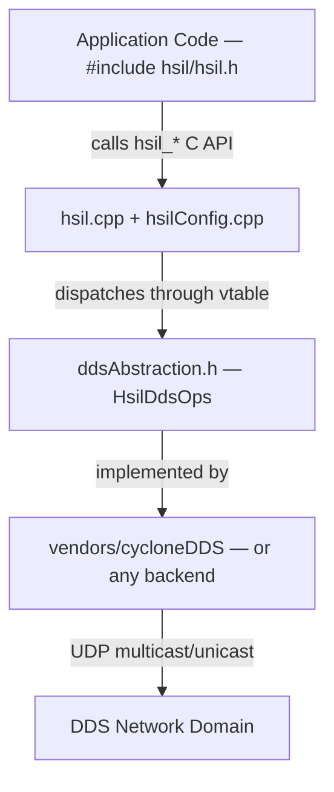

# Architecture & Design

---

## Layer Diagram

---

## Segment Roles

### Public Interface (`hsil/hsil.h`)
Pure C API. Imposes no C++ runtime dependencies on consumers. Opaque session pointer types hide all C++ objects.

### Core Session Manager (`hsil.cpp` + `hsilConfig.cpp`)
Bridge between the public C API and the DDS abstraction layer. Manages topic states, publisher/subscriber lifecycle, thread-safe callback dispatch, and JSON config parsing.

### DDS Abstraction (`src/ddsAbstraction.h`)
A C-style vtable struct (`HsilDdsOps`) of function pointers. No DDS headers are exposed to the core library or consumers. The active vendor is selected at build time via `-DHSIL_DDS_VENDOR`.

### Vendor Backend (`src/vendors/`)
Concrete DDS provider (e.g. `cycloneDDS`). Compiled as a CMake **OBJECT library** whose `.o` files are merged directly into `libhsil_cosim.so`, keeping DDS and IDL symbols out of the exported symbol table.

---

## Key Design Decisions

### Pure C Public API
All exported symbols in `hsil/hsil.h` are wrapped in `extern "C"`. This makes the library callable from C and C++ without runtime dependency issues, and bindable via FFI in Python, Rust, and LabVIEW.

### C++17 Internal Implementation
`hsil.cpp` and `hsilConfig.cpp` use `std::map`, `std::vector`, smart pointers, and mutexes internally. All C++ details are hidden behind the C boundary — consumers never see them.

### Vtable-Based DDS Abstraction
`HsilDdsOps` (in `src/ddsAbstraction.h`) is a struct of function pointers. The core library never includes any DDS headers. Swapping DDS vendors requires only a new `vendors/<name>/` directory with a `CMakeLists.txt` and an implementation of `hsil_getDdsOps()` — no changes to `hsil.cpp`.

### Exception Safety
Every public API function uses a **function-try-block** to catch any C++ exception and map it to `HSIL_ERR_GENERIC`. No exception can cross the C API boundary.
