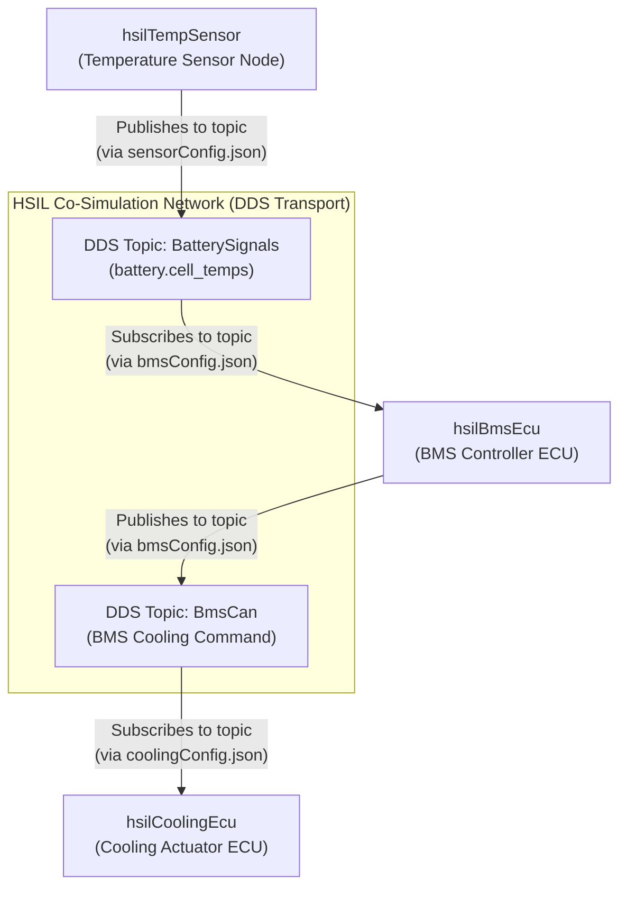

BMS Config-Mode Example
=======================

This folder contains a small HSIL Co-Simulation scenario demonstrating battery temperature monitoring 
and a simple cooling command flow. This example uses hsil configuration files to configure the Co-Simulation participants.

Overview Block Diagram
----------------------



Executables
-----------
- `hsilTempSensor` — publishes a 4-element `float32` array `battery.cell_temps` every 10 ms. Interactive: type `o` (over) or `n` (normal) on stdin to change temperatures.
- `hsilBmsEcu` — subscribes `BatterySignals`, evaluates temperatures, and publishes a CAN command on `BmsCan` when any cell exceeds 55°C.
- `hsilCoolingEcu` — subscribes `BmsCan` and prints the received cooling command.

Config files
------------
- `sensorConfig.json` — sensor-only: publishes `BatterySignals`.
- `bmsConfig.json` — BMS ECU: subscribes `BatterySignals` and publishes `BmsCan`.
- `coolingConfig.json` — Cooling ECU: subscribes `BmsCan`.

Run
---
Build (already done via `lib/build` in this workspace):

```bash
cd lib/build/bin
```

Run components (each in its own terminal):

```bash
# Sensor (interactive):
./hsilTempSensor

# BMS ECU:
./hsilBmsEcu

# Cooling ECU:
./hsilCoolingEcu
```

Notes
-----
- The examples use the HSIL config-mode APIs (`hsil_create_from_config`,
  `hsil_read_signal_by_name`, `hsil_write_signal_by_name`, `hsil_publish_streaming`).
- Use `./hsilTempSensor` without args to run the combined `bmsScenario.json`.
